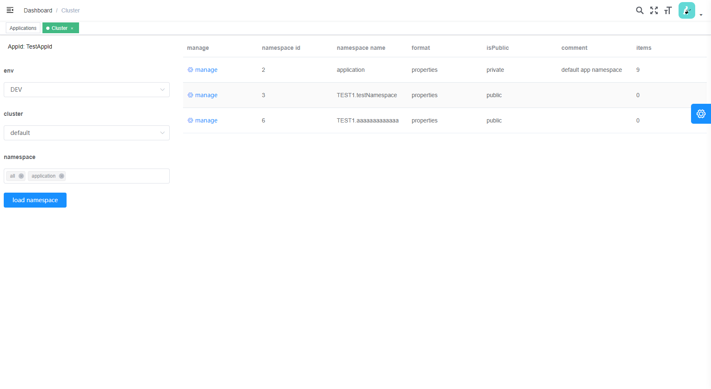
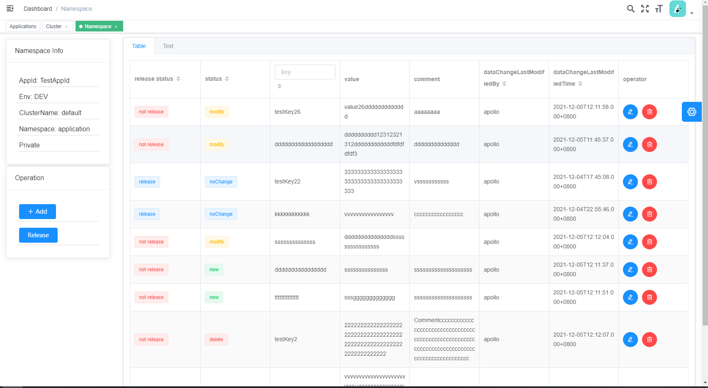

# Apollo web ui portal

> Apollo 的一个新UI  
> 基于 [vue-element-admin](https://github.com/PanJiaChen/vue-element-admin) & [Apollo](https://github.com/apolloconfig/apollo) 构建

# 开发
## 配置
`vi vue.config.js`  
配置样例:
```
    proxy: {
      '/api/': {
        'target': 'http://localhost:8070',
        'pathRewrite': {
          '^/api': ''
        },
        'changeOrigin': true
      }
    }
```
`http://localhost:8070` 是 Apollo portal 的URL
## 运行 
`npp run dev`

# 构建
`npm run build:prod`  
将 dist/index.html 重命名为 dist/vue.html
将构建后的 `dist/` 下的文件复制到 `apollo-portal\src\main\resources\static\`  

启动 http://localhost:8070 登录  
访问 http://localhost:8070/vue.html  

# 功能
- 应用新增查询
- 查询命名空间
- 管理配置项

# 其他
这个前端工程比我预想的要复杂一些，特别是配置项维护页面，可能要花不少时间。  
前端直接使用的原portal的接口，不太想改java，但是用起来有点别扭。  
现在只是一个DEMO，还不好用。


